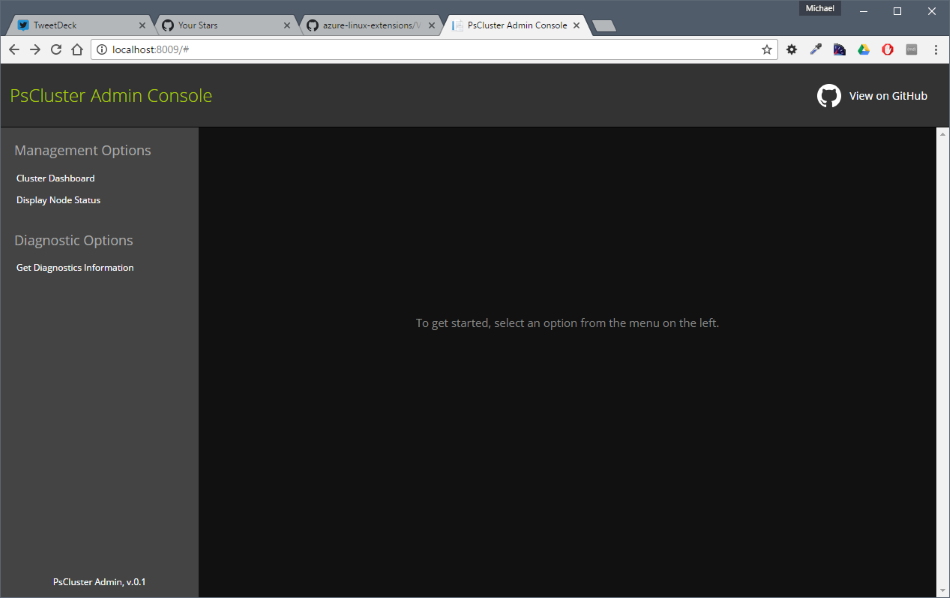

PsCluterAdmin
=============

### Introduction

PsClusterAdmin is a demonstration tool for managing an Azure VM ScaleSet from both 
PowerShell cmdlets, as well as a web-based visualizer. This is purely a proof-of-concept, 
and not intended to replace any functionality. Plus, it's fun!

### Operation

The basic idea will be to provide some higher-level PowerShell functions to create a 
cluster object. This will orchestrate creation of an Azure Vm ScaleSet, and allow the cluster 
status to be viewed through the web UI (shown below).

Additionally, a companion script is installed on each cluster member to allow one-way communication 
from the PowerShell environment. This can be used for job control, etc. In this demo we are simply 
having each member create some random numeric data, summarize it, and report it back to the web UI.

### TODO

There is *lots* to do. This is just a fun idea, but there's a good amount of moving pieces here. 
 